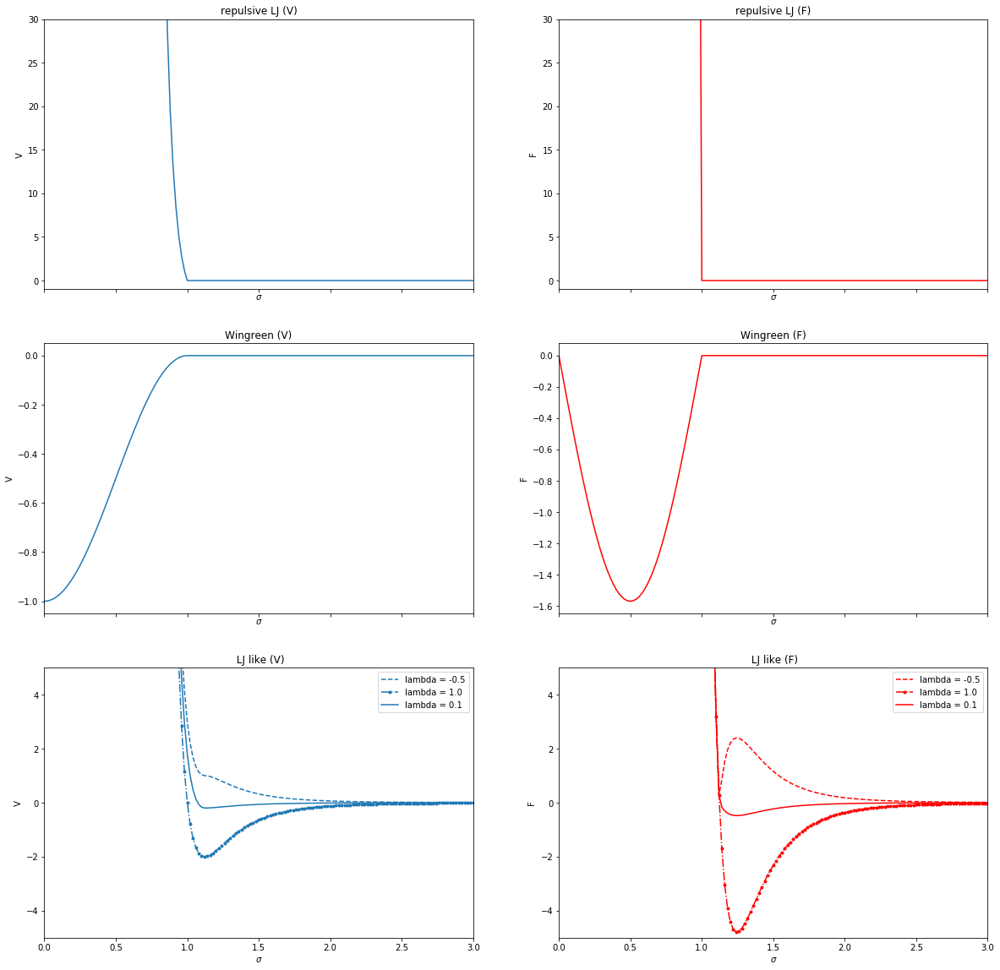

Project CG_model_LLPS
---------------------

In table are reported the atomic types with relative mass, charge and sigma.
As a first attempt we have chosen the following parameters.

| Atomtype | mass   | charge | sigma         |  
|----------|--------|--------|---------------| 
| A        | 100 Da | 0.0    |    1 $\sigma$ | 
| Bc       | 100 Da | 0.0    | 3 $\sigma$    | 
| Bs       | 100 Da | 0.0    | 1 $\sigma$    | 

In table are reported the molecules present in our model and the relative sequence.

| Molecule | Sequence |
|----------|----------|
| poiyA    | A- $\cdots$ - A (n $\cdot$ A)
| B        | Bs - Bc | 

In table are reported the bond interactions of molecule in our model.


| molecule         | atoms | interaciton type | params  |
|------------------|-------|------------------|--------------------------------------------------------------------------|
| polyA            | A - A | Harmonic         | $k_A$ = 1000 $kJ/mol$ $\cdot$ $\frac{1}{nm^{2}}$; $r_{0A}$ = $\sigma_A$          |    
| B                | Bs-Bc | Harmonic         | $K_B$ = 1000 $kJ/mol$ $\cdot$ $\frac{1}{nm^{2}} $; $r_{0B}$ = $\frac{\sigma_{Bs}}{2}$ + $\frac{\sigma_{Bc}}{2}$  |

In table are reported all possible non-bonded interaction and the type of function used to described it.

| atoms    | type  |
|----------|------|
| A -A     | Lennard - Jones Troncated   |
| A - Bs   | Wingreen    |
| A - Bc   | Lennard - Jones Troncated    |
| Bs - Bs  | Lennard - Jones Troncated   |
| Bs - Bc  | Lennard - Jones Troncated    |
| Bc - Bc  | Ashbaugh - Hatch    |

Here the explicit analitical expressions of the interactions.


 1-              Lennard - Jones Troncated 
 
$$    V(r) = 4  \epsilon \cdot \left[(\frac{\sigma}{r})^{12} -  (\frac{\sigma}{r})^6 \right]  $$

if $r < \sigma$. And 

$$
    V(r) = 0                                                                       
$$ 

if $r \ge \sigma$.


 2 -              Wingreen (*)       
 
$$
    V(r) = -\frac{1}{2}V_0 (1 + \cos{\frac{\pi r}{\sigma}})   
$$

if $r < \sigma$.  $V_0$ = 14 $K_bT$ from litterature. And

$$
V(r) = 0                                                 
$$    

if $r \ge \sigma$.

 3 -            Ashbaugh - Hatch    

$$ 
   V(r) = \Phi_{LJ} + (1 -\lambda) \epsilon   
$$

if $r < 2^{\frac{1}{6}}\sigma$}. And

$$
    V(r) = \lambda \Phi_{LJ}                   
$$      

if $r \ge 2^{\frac{1}{6}} \sigma$


Using Gromacs to run CG model simulations, we cannot express interactions through analytic functions but we have to use numerical values with tables. We decided to provide 3 tables; each referring to a specific $ \sigma $ value.

<table class="tg">
<thead>
  <tr>
    <th class="tg-0pky">atoms</th>
    <th class="tg-0pky">type (index)</th>
    <th class="tg-0pky">$\sigma$</th>
    <th class="tg-0pky">table name</th>
  </tr>
</thead>
<tbody>
  <tr>
    <td class="tg-0pky">A -A</td>
    <td class="tg-0pky">1</td>
    <td class="tg-0pky">1 $\sigma$</td>
    <td class="tg-0pky" rowspan="3">table_ABsite_ABsite.xvg</td>
  </tr>
  <tr>
    <td class="tg-0pky">A - Bs</td>
    <td class="tg-0pky">2</td>
    <td class="tg-0pky">1 $\sigma$</td>
  </tr>
  <tr>
    <td class="tg-0pky">Bs - Bs</td>
    <td class="tg-0pky">1</td>
    <td class="tg-0pky">1 $\sigma$</td>
  </tr>
  <tr>
    <td class="tg-0pky">A - Bc</td>
    <td class="tg-0pky">1</td>
    <td class="tg-0pky">2 $\sigma$</td>
    <td class="tg-0pky" rowspan="2">table_ABsite_Bcore.xvg</td>
  </tr>
  <tr>
    <td class="tg-0pky">Bs - Bc</td>
    <td class="tg-0pky">1</td>
    <td class="tg-0pky">2 $\sigma$</td>
  </tr>
  <tr>
    <td class="tg-0pky">Bc - Bc</td>
    <td class="tg-0pky">3</td>
    <td class="tg-0pky">3 $\sigma$</td>
    <td class="tg-0pky">table_Bcore_Bcore.xvg<br><br></td>
  </tr>
</tbody>
</table>

------------------------------

Here is possible to see how the tables are designed.

**table_ABsite_ABsite.xvg** with $\sigma'$ = 1 $\sigma$

<table class="tg">
<thead>
  <tr>
    <th class="tg-0lax" colspan="7">  table_ABsite_ABsite.xvg                        </th>
  </tr>
</thead>
<tbody>
  <tr>
    <td class="tg-0lax">r     </td>
    <td class="tg-0lax">f      </td>
    <td class="tg-0lax">-f     </td>
    <td class="tg-0lax">g      </td>
    <td class="tg-0lax">-g'    </td>
    <td class="tg-0lax">h      </td>
    <td class="tg-0lax">-h'    </td>
  </tr>
  <tr>
    <td class="tg-0lax">0.02<br></td>
    <td class="tg-0lax">0.00</td>
    <td class="tg-0lax">0.00</td>
    <td class="tg-0lax">$\vdots$</td>
    <td class="tg-0lax">$\vdots$</td>
    <td class="tg-0lax">$\vdots$</td>
    <td class="tg-0lax">$\vdots$</td>
  </tr>
  <tr>
    <td class="tg-0lax">0.02</td>
    <td class="tg-0lax">0.00</td>
    <td class="tg-0lax">0.00</td>
    <td class="tg-0lax">$\mathrm{LJ_T^{\sigma}}$</td>
    <td class="tg-0lax">$\mathrm{- \nabla {LJ_T^{\sigma}}}$</td>
    <td class="tg-0lax">$\mathrm{ W^{\sigma} }$</td>
    <td class="tg-0lax">$\mathrm{\nabla W^{\sigma}}$</td>
  </tr>
  <tr>
    <td class="tg-0lax"> $\vdots$<br></td>
    <td class="tg-0lax">$\vdots$</td>
    <td class="tg-0lax">$\vdots$</td>
    <td class="tg-0lax">$\vdots$</td>
    <td class="tg-0lax">$\vdots$</td>
    <td class="tg-0lax">$\vdots$</td>
    <td class="tg-0lax">$\vdots$</td>
  </tr>
  <tr>
    <td class="tg-0lax"> $\mathrm{r_{cutoff} + 1}$<br></td>
    <td class="tg-0lax">$ 0.00 $</td>
    <td class="tg-0lax">$ 0.00 $</td>
    <td class="tg-0lax">$\vdots$</td>
    <td class="tg-0lax">$\vdots$</td>
    <td class="tg-0lax">$\vdots$</td>
    <td class="tg-0lax">$\vdots$</td>
  </tr>
</tbody>
</table>


with $\mathrm{LJ_T^{\sigma}}$ Lennard-Jonnes trucated ($\sigma$);

$$ \mathrm{LJ_T^{\sigma} = 4  \epsilon \cdot \left[\left(\frac{\sigma}{r}\right)^{12} - \left(\frac{\sigma}{r}\right)^6 \right] \cdot (r<\sigma)} $$

$$ \mathrm{ - \nabla LJ_T^{\sigma} = 4  \epsilon \cdot \left(-12 \cdot \frac{\sigma^{12}}{r^{13}} - 6 \frac{\sigma^6}{r^7}\right) \cdot (r<\sigma)} $$   


with $\mathrm{W^{\sigma}}$ Wingreen ($\sigma$);


$$ \mathrm{W^{\sigma} = - \frac{1}{2} \cdot V_0 \cdot \left(1 + \cos{\frac{\pi r}{\sigma}}\right) \cdot (r<\sigma)}$$

$$
 \mathrm{- \nabla W^{\sigma} = - \frac{1}{2} \cdot V_0 \cdot \sin \left({\frac{\pi r}{\sigma}}\right) \cdot \frac{\pi}{\sigma} \cdot (r<\sigma) }
$$

-----------------------------------------

**table_ABsite_Bcore.xvg** with $\sigma'$ = 2 $\sigma$

<table class="tg">
<thead>
  <tr>
    <th class="tg-0lax" colspan="7">  table_ABsite_Bcore.xvg                        </th>
  </tr>
</thead>
<tbody>
  <tr>
    <td class="tg-0lax">r     </td>
    <td class="tg-0lax">f      </td>
    <td class="tg-0lax">-f     </td>
    <td class="tg-0lax">g      </td>
    <td class="tg-0lax">-g'    </td>
    <td class="tg-0lax">h      </td>
    <td class="tg-0lax">-h'    </td>
  </tr>
  <tr>
    <td class="tg-0lax">0.02<br></td>
    <td class="tg-0lax">0.00</td>
    <td class="tg-0lax">0.00</td>
    <td class="tg-0lax">$\vdots$</td>
    <td class="tg-0lax">$\vdots$</td>
    <td class="tg-0lax">$0.00$</td>
    <td class="tg-0lax">$0.00$</td>
  </tr>
  <tr>
    <td class="tg-0lax">0.02</td>
    <td class="tg-0lax">0.00</td>
    <td class="tg-0lax">0.00</td>
    <td class="tg-0lax">$\mathrm{LJ_T^{2 \sigma}}$</td>
    <td class="tg-0lax">$\mathrm{- \nabla {LJ_T^{2 \sigma}}}$</td>
    <td class="tg-0lax">$0.00$</td>
    <td class="tg-0lax">$0.00$</td>
  </tr>
  <tr>
    <td class="tg-0lax"> $\vdots$<br></td>
    <td class="tg-0lax">$\vdots$</td>
    <td class="tg-0lax">$\vdots$</td>
    <td class="tg-0lax">$\vdots$</td>
    <td class="tg-0lax">$\vdots$</td>
    <td class="tg-0lax">$\vdots$</td>
    <td class="tg-0lax">$\vdots$</td>
  </tr>
  <tr>
    <td class="tg-0lax"> $\mathrm{r_{cutoff}+1}$<br></td>
    <td class="tg-0lax">$ 0.00 $</td>
    <td class="tg-0lax">$ 0.00 $</td>
    <td class="tg-0lax">$\vdots$</td>
    <td class="tg-0lax">$\vdots$</td>
    <td class="tg-0lax">$0.00$</td>
    <td class="tg-0lax">$0.00$</td>
  </tr>
</tbody>
</table>


with $\mathrm{LJ_T^{2 \sigma}}$ Lennard-Jonnes trucated ($2 \sigma$);

$$ \mathrm{LJ_T^{2\sigma} = 4  \epsilon \cdot \left[\left(\frac{2\sigma}{r}\right)^{12} - \left(\frac{2\sigma}{r}\right)^6 \right] \cdot (r<2\sigma)} $$

$$ \mathrm{ - \nabla LJ_T^{2\sigma} = 4  \epsilon \cdot \left(-12 \cdot \frac{(2\sigma)^{12}}{r^{13}} - 6 \frac{(2\sigma)^6}{r^7}\right) \cdot (r<2\sigma)} $$

------------------------

**table_Bcore_Bcore.xvg** with $\sigma'$ = 3 $\sigma$

<table class="tg">
<thead>
  <tr>
    <th class="tg-0lax" colspan="7">  table_Bcore_Bcore.xvg                        </th>
  </tr>
</thead>
<tbody>
  <tr>
    <td class="tg-0lax">r     </td>
    <td class="tg-0lax">f      </td>
    <td class="tg-0lax">-f     </td>
    <td class="tg-0lax">g      </td>
    <td class="tg-0lax">-g'    </td>
    <td class="tg-0lax">h      </td>
    <td class="tg-0lax">-h'    </td>
  </tr>
  <tr>
    <td class="tg-0lax">0.02<br></td>
    <td class="tg-0lax">0.00</td>
    <td class="tg-0lax">0.00</td>
    <td class="tg-0lax">$\vdots$</td>
    <td class="tg-0lax">$\vdots$</td>
    <td class="tg-0lax">$\vdots$</td>
    <td class="tg-0lax">$\vdots$</td>
  </tr>
  <tr>
    <td class="tg-0lax">0.02</td>
    <td class="tg-0lax">0.00</td>
    <td class="tg-0lax">0.00</td>
    <td class="tg-0lax">$\mathrm{LJ_{l1}^{3\sigma}}$ </td>
    <td class="tg-0lax">$\mathrm{- \nabla {LJ_{l1}^{3\sigma}}}$</td>
    <td class="tg-0lax">$\mathrm{ LJ_{l2}^{3\sigma} }$</td>
    <td class="tg-0lax">$\mathrm{\nabla LJ_{l2}^{3\sigma}}$</td>
  </tr>
  <tr>
    <td class="tg-0lax"> $\vdots$<br></td>
    <td class="tg-0lax">$\vdots$</td>
    <td class="tg-0lax">$\vdots$</td>
    <td class="tg-0lax">$\vdots$</td>
    <td class="tg-0lax">$\vdots$</td>
    <td class="tg-0lax">$\vdots$</td>
    <td class="tg-0lax">$\vdots$</td>
  </tr>
  <tr>
    <td class="tg-0lax"> $\mathrm{r_{cutoff} + 1}$<br></td>
    <td class="tg-0lax">$ 0.00 $</td>
    <td class="tg-0lax">$ 0.00 $</td>
    <td class="tg-0lax">$\vdots$</td>
    <td class="tg-0lax">$\vdots$</td>
    <td class="tg-0lax">$\vdots$</td>
    <td class="tg-0lax">$\vdots$</td>
  </tr>
</tbody>
</table>


with $\mathrm{LJ_{like 1}^{3 \sigma}}$ Lennard-Jonnes like_1 ($3 \sigma$) [Ashbaugh - Hatch ];

$$ \mathrm{LJ_{like 1}^{3\sigma} =  \left[ 4  \epsilon \cdot \left[\left(\frac{3\sigma}{r}\right)^{12} - \left(\frac{3\sigma}{r}\right)^6 \right] + \epsilon \right] \cdot (r< 2^\frac{1}{6} \cdot 3\sigma)}  $$

$$ \mathrm{ - \nabla LJ_{like 1}^{3\sigma} = 4  \epsilon \cdot \left(-12 \cdot \frac{(3\sigma)^{12}}{r^{13}} - 6 \frac{(3\sigma)^6}{r^7}\right) \cdot (r< 2^\frac{1}{6} \cdot 3\sigma)} $$

with $\mathrm{LJ_{like 2}^{3 \sigma}}$ Lennard-Jonnes like_2 ($3 \sigma$);

$$ \mathrm{LJ_{like 2}^{3\sigma} = \lambda \cdot \left[ - \epsilon \cdot (r< 2^\frac{1}{6} \cdot 3\sigma) +  4  \epsilon \cdot \left[\left(\frac{3\sigma}{r}\right)^{12} - \left(\frac{3\sigma}{r}\right)^6 \right] \cdot (r \ge 2^\frac{1}{6} \cdot 3\sigma) \right] } $$

$$ \mathrm{ - \nabla LJ_{like 2}^{3\sigma} = \lambda \cdot  4  \epsilon \cdot \left(-12 \cdot \frac{(3\sigma)^{12}}{r^{13}} - 6 \frac{(3\sigma)^6}{r^7}\right) \cdot (r \ge 2^\frac{1}{6} \cdot 3\sigma)}$$

----------------------------------

The following cell shows the expressions of the interactions in Python.


```python
# functions section

def LJ_repulsive(r,sigma,epsilon):
    V_r = 4 * epsilon * ((sigma/r)**12 - (sigma/r)**6) * (r<sigma)
    return V_r

def force_LJ_repulsive(r,sigma,epsilon):
    F_r = 4 * epsilon * ( (12 * (sigma**12) / r**13)  - ( 6 * (sigma**6) / r**7 ) ) * (r<sigma)
    return F_r

def Wingreen(r,V_0,r_0):
    V_r = -0.5 * V_0 * (1 + np.cos( math.pi * r / r_0)) * (r < r_0)
    return V_r

def force_Wingreen(r,V_0,r_0):
    F_r = -0.5 * V_0 *  np.sin( math.pi * r / r_0) *  math.pi / r_0 * (r < r_0)
    return F_r

def LJ_like(r,sigma,epsilon,lambd):
    V_r = (4 * epsilon * ((sigma/r)**12 - (sigma/r)**6) +  (1-lambd)*epsilon) * (r<= 2**(1/6)*sigma) + lambd * 4 * epsilon * ((sigma/r)**12 - (sigma/r)**6) *  (r> 2**(1/6)*sigma)                                                                            
    return V_r

def force_LJ_like(r,sigma,epsilon,lambd):
    F_r = 4 * epsilon * ( (12 * (sigma**12) / r**13)  - ( 6 * (sigma**6) / r**7 ) ) * (r<= 2**(1/6)*sigma) + 4 * lambd * epsilon * ( (12 * (sigma**12) / r**13)  - ( 6 * (sigma**6) / r**7 ) ) * (x > 2**(1/6)*sigma)     
    return F_r

#--------------------------------------------------------------------
# for simplicity split 2 terms. One depending on lambda.

def LJ_like_4_table_1(r,sigma,epsilon):
    V_r = (( 4 * epsilon * ((sigma/r)**12 - (sigma/r)**6)) + epsilon ) * (r<= 2**(1/6)*sigma)                                  
    return V_r

def force_LJ_like_4_table_1(r,sigma,epsilon):
    F_r = 4 * epsilon * ( (12 * (sigma**12) / r**13)  - ( 6 * (sigma**6) / r**7 ) ) * (r<= 2**(1/6)*sigma)  
    return F_r

def LJ_like_4_table_2(r,sigma,epsilon):
    V_r = -epsilon * (r<= 2**(1/6)*sigma)  + 4 * epsilon * ((sigma/r)**12 - (sigma/r)**6) *  (r> 2**(1/6)*sigma)                                                                        
    return V_r

def force_LJ_like_4_table_2(r,sigma,epsilon):
    F_r = 4 * epsilon * ( (12 * (sigma**12) / r**13)  - ( 6 * (sigma**6) / r**7 ) ) * (r> 2**(1/6)*sigma)
    return F_r

```

In the following cell are plotted the analytical funcions describing the interactions in the CG model.


```python
# check analytical functions

fig, ax = plt.subplots(3,2, figsize=(20, 20), sharex=True)

# x points for gromacs
x = np.arange(0,10,0.02)

ax[0,0].set_xlim(0,3)
ax[0,0].set_ylim(-1,3*10)
ax[0,0].plot(x,LJ_repulsive(x, sigma=1, epsilon=2))
ax[0,0].set_title('repulsive LJ (V)')
ax[0,0].set_xlabel('$ \sigma$ ')
ax[0,0].set_ylabel(' V ')

ax[0,1].plot(x,force_LJ_repulsive(x ,sigma=1,epsilon=2), color='r')
ax[0,1].set_ylim(-1,3*10)
ax[0,1].set_title('repulsive LJ (F)')
ax[0,1].set_xlabel('$ \sigma$ ')
ax[0,1].set_ylabel(' F ')

ax[1,0].set_xlim(0,3)
ax[1,0].plot(x,Wingreen(x, V_0=1, r_0=1))
ax[1,0].set_title('Wingreen (V)')
ax[1,0].set_xlabel('$ \sigma$ ')
ax[1,0].set_ylabel(' V ')

ax[1,1].plot(x,force_Wingreen(x, V_0=1, r_0=1), color='r')
ax[1,1].set_title('Wingreen (F)')
ax[1,1].set_xlabel('$ \sigma$ ')
ax[1,1].set_ylabel(' F ')

ax[2,0].set_xlim(0,3)
ax[2,0].plot(x,LJ_like(x, sigma=1, epsilon=2, lambd=-0.5), '--' , color='C0', label='lambda = -0.5')
ax[2,0].plot(x,LJ_like(x, sigma=1,epsilon=2, lambd=1),'.-.' , color='C0', label='lambda = 1.0')
ax[2,0].plot(x,LJ_like(x, sigma=1, epsilon=2, lambd=0.1), '-', color='C0',label='lambda = 0.1')
ax[2,0].set_ylim(-5,5)
ax[2,0].set_title(' LJ like (V)')
ax[2,0].set_xlabel('$ \sigma$ ')
ax[2,0].set_ylabel(' V ')
ax[2,0].legend()

ax[2,1].plot(x,force_LJ_like(x, sigma=1, epsilon=2, lambd=-0.5), '--' , color='r', label='lambda = -0.5')
ax[2,1].plot(x,force_LJ_like(x,sigma=1,epsilon=2, lambd=1),'.-.' , color='r', label='lambda = 1.0')
ax[2,1].plot(x,force_LJ_like(x,sigma=1,epsilon=2, lambd=0.1), '-', color='r',label='lambda = 0.1')
ax[2,1].set_ylim(-5,5)
ax[2,1].set_title(' LJ like (F)')
ax[2,1].set_xlabel('$ \sigma$ ')
ax[2,1].set_ylabel(' F ')
ax[2,1].legend();

#plt.plot(x,force_LJ_repulsive(x,1,1))
```





For convenience we set to 0 all parametres ($\epsilon$, $V_0$ and $\lambda$) present in tables. In this way is possible to change all params directly on topol.top file, without changing the tables. Here is reported the summary table:

<table class="tg">
<thead>
  <tr>
    <th class="tg-0lax" colspan="10">[nonbond_params]</th>
  </tr>
</thead>
<tbody>
  <tr>
    <td class="tg-0lax"> atoms        <br></td>
    <td class="tg-0lax">          C    </td>
    <td class="tg-0lax">          A    </td>
    <td class="tg-0lax">       $\sigma$ </td>
  </tr>
  <tr>
    <td class="tg-0lax">A A<br></td>
    <td class="tg-0lax">$\epsilon$<br></td>
    <td class="tg-0lax">0</td>
    <td class="tg-0lax" rowspan="3">$1 \sigma$<br></td>
  </tr>
  <tr>
    <td class="tg-0lax">A Bs</td>
    <td class="tg-0lax">0</td>
    <td class="tg-0lax">$V_0$<br></td>
  </tr>
  <tr>
    <td class="tg-0lax">Bs Bs<br></td>
    <td class="tg-0lax">$\epsilon$</td>
    <td class="tg-0lax">0</td>
  </tr>
  <tr>
    <td class="tg-0lax">A&nbsp;&nbsp;Bc</td>
    <td class="tg-0lax">$\epsilon$</td>
    <td class="tg-0lax">0</td>
    <td class="tg-0lax" rowspan="2">$2 \sigma$</td>
  </tr>
  <tr>
    <td class="tg-0lax">Bs Bc</td>
    <td class="tg-0lax">$\epsilon$</td>
    <td class="tg-0lax">0</td>
  </tr>
  <tr>
    <td class="tg-0lax">Bc Bc</td>
    <td class="tg-0lax">$\epsilon$</td>
    <td class="tg-0lax">$\lambda \epsilon$</td>
    <td class="tg-0lax">$3 \sigma$</td>
  </tr>
</tbody>
</table>

note that $V(r) = C \cdot g(r) + A \cdot h(r)$.
